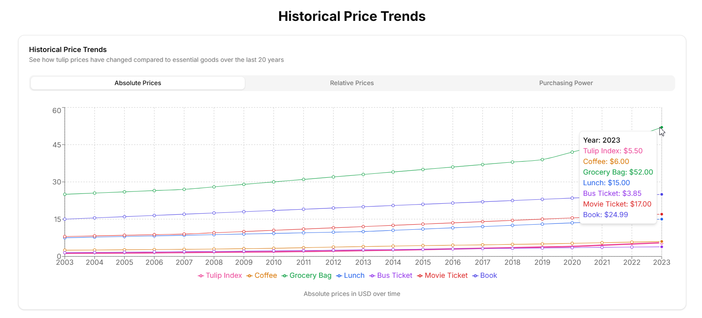

# Tulip Index

This is a multilingual web application that allows users to analyze tulip prices over the last 20 years and compare their value to essential goods. Users can adjust the number of tulips via a slider and see what equivalent items they could purchase with the same amount of money.


## Project Overview

The Tulip Index is a Next.js application that demonstrates the purchasing power of tulips compared to everyday items. It provides an interactive interface where users can:

- Calculate the value of different quantities of tulips
- Compare tulip prices to essential goods like coffee, groceries, and transportation
- View historical price trends over the past 20 years
- Switch between English and Ukrainian languages with automatic currency conversion

The application serves as both a practical tool for understanding relative value and a demonstration of modern web development techniques including internationalization, responsive design, and interactive data visualization.




## Features

- **Interactive Price Calculator**: Adjust tulip quantity via slider or direct input
- **Real-time Price Comparison**: See equivalent items you could purchase with the same amount
- **Historical Price Trends**: View how tulip prices have changed over time compared to other goods
- **Multilingual Support**: Full localization in English and Ukrainian
- **Automatic Currency Conversion**: Prices displayed in USD or UAH based on selected language
- **Responsive Design**: Optimized for all device sizes from mobile to desktop
- **Animated UI Elements**: Smooth transitions and animations for an engaging user experience

## Technologies Used

- **Next.js 15**: React framework with server-side rendering capabilities
- **React 19**: UI component library
- **TypeScript**: Type-safe JavaScript
- **Tailwind CSS**: Utility-first CSS framework for styling
- **Framer Motion**: Animation library for React
- **Recharts**: Composable charting library for data visualization
- **Radix UI**: Unstyled, accessible UI components
- **Custom i18n Implementation**: For multilingual support

## How to Run the Project Locally

1. Clone the repository:
```bash
git clone https://github.com/getFrontend/app-tulip-index.git
cd app-tulip-index
```

2. Install dependencies:
```bash
npm install
```

3. Run the development server:
```bash
npm run dev
```

4. Open [http://localhost:3000](http://localhost:3000) with your browser to see the result.

## Localization Setup

The application uses a custom internationalization (i18n) implementation to support multiple languages:

- Translation keys are stored in `lib/i18n/translations.ts`
- The `LanguageProvider` in `lib/i18n/context.tsx` manages language state and provides translation functions
- Language can be switched using the language switcher in the header
- Currency is automatically converted based on the selected language (USD for English, UAH for Ukrainian)

To add a new language:
1. Add the new language code to the `Language` type in `translations.ts`
2. Add translations for all keys in the translations object
3. Update the language switcher component to include the new language option

## Folder Structure

```
app-tulip-index/
├── app/                  # Next.js app directory
│   ├── client-page.tsx   # Client-side page component
│   ├── globals.css       # Global styles
│   ├── layout.tsx        # Root layout component
│   └── page.tsx          # Main page component (server)
├── components/           # React components
│   ├── currency-display.tsx
│   ├── historical-trends.tsx
│   ├── language-switcher.tsx
│   ├── price-calculator.tsx
│   ├── price-comparison.tsx
│   ├── site-footer.tsx
│   ├── site-header.tsx
│   └── ui/               # UI components (buttons, cards, etc.)
├── constants/            # Application constants
├── lib/                  # Utility functions and data
│   ├── data.ts           # Data fetching functions
│   ├── i18n/             # Internationalization
│   │   ├── context.tsx   # Language context provider
│   │   └── translations.ts # Translation strings
│   ├── tulip-data.json   # Historical price data
│   ├── types.ts          # TypeScript type definitions
│   └── utils.ts          # Utility functions
└── public/               # Static assets
    └── assets/           # Images and other assets
```

## Future Improvements

- Add more languages and currencies
- Implement server-side language detection based on user's browser settings
- Add more historical data and improve visualization options
- Create a mobile app version using React Native
- Add user accounts to save preferences
- Implement dark mode support
- Add more comparison items and categories

## Contributing

Contributions are welcome! Please feel free to submit a Pull Request.

## License

This project is licensed under the MIT License - see the LICENSE file for details.

---

© 2025 Tulip Index. All rights reserved.